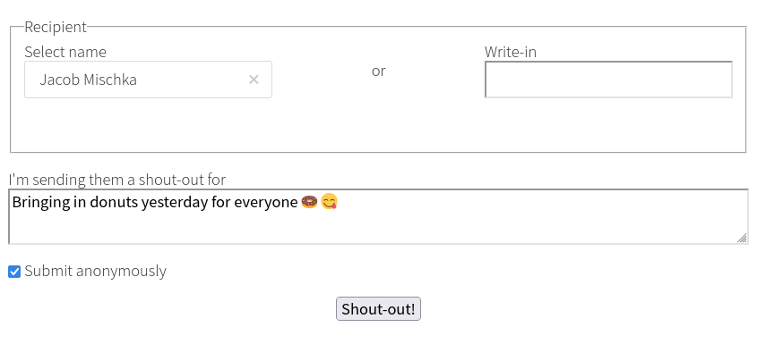
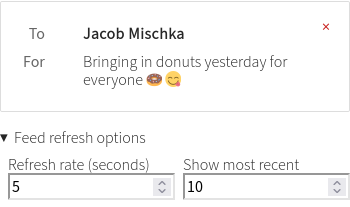
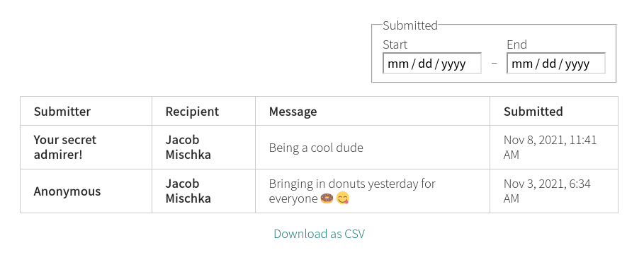

# Shout-outs!

A simple WordPress plugin for giving shout-outs to others for all to see.

## Form

Supports selecting registered WordPress users from a list, or entering a
write-in if the recipient is anonymous, unknown, or a group.
Submissions are anonymous by default, but the submitter can opt to show their
name if logged in, or enter a name if desired or if not logged in.

Use the `[shoutouts-form /]` shortcode to add to any block, page, or post.

The submit button text can be customized by adding a `submit-button-text`
property to the shortcode, and the message textarea label can be customized
using a `message-label` property.

## Feed

Features user-configurable auto-refresh interval and list length.
Users can delete shout-outs they submitted using the red `×` in the
upper-right, and WordPress administrators can delete any shout-out.

Use the `[shoutouts-feed /]` shortcode to add to any block, page, or post.

## List

A complete list of all submitted shout-outs.

Use the `[shoutouts-list /]` shortcode to add to any block, page, or post.
